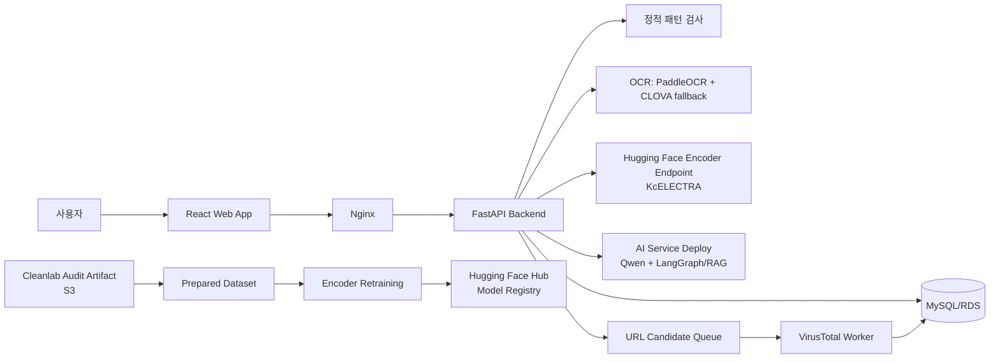

# NewBiz Shield

> 문자, URL, 이미지 속 스미싱 징후를 분석하고 안전한 다음 행동을 안내하는 AI 기반 스미싱 탐지 서비스

NewBiz Shield는 사용자가 받은 문자 메시지, 의심 URL, 문자 화면 캡처를 분석해 스미싱 위험도와 근거를 제공하는 웹 서비스입니다. 알려진 악성 패턴은 빠르게 차단하고, 새롭거나 모호한 문자는 KcELECTRA 분류 모델과 LLM 기반 설명 생성으로 판단 근거를 보완합니다.

## 프로젝트 목표

- 스미싱 여부를 사용자가 이해하기 쉬운 위험도와 근거로 전달합니다.
- 링크, 전화번호, 금전 요구, 개인정보 요구, 긴급성, 기관 사칭 등 복합 신호를 함께 확인합니다.
- 신고와 URL 검증 결과를 정적 패턴 및 모델 개선 흐름으로 연결합니다.
- 고령 사용자도 사용할 수 있는 시니어 전용 화면과 명확한 대응 안내를 제공합니다.

## 핵심 기능

| 기능        | 설명                                                                                  |
| ----------- | ------------------------------------------------------------------------------------- |
| 문자 분석   | 정적 패턴 검사와 KcELECTRA Encoder 추론으로 정상/스미싱 위험도를 판정합니다.          |
| URL 분석    | 알려진 악성 URL을 즉시 탐지하고, 신규 후보는 VirusTotal 검증 대기열로 보냅니다.       |
| 이미지 분석 | OCR로 문자 화면의 텍스트를 추출한 뒤 동일한 SMS 분석 파이프라인을 적용합니다.         |
| 설명 생성   | 스미싱으로 판정된 문자에 대해 Qwen 기반 LLM/RAG 서비스가 사용자용 설명을 생성합니다.  |
| 신고        | 문자·URL·발신번호 신고를 저장하고, URL은 후보 검증과 관리자 검토 흐름으로 연결합니다. |
| 시니어 모드 | 큰 글씨, 단순한 화면, 쉬운 표현의 분석 결과와 대응 안내를 제공합니다.                 |
| 운영 관측   | Prometheus, Grafana, Langfuse 기반으로 API·인프라·LLM 호출을 관측합니다.              |

## 서비스 흐름



### SMS 분석 순서

1. 사용자가 문자 내용과 선택적 발신번호를 입력합니다.
2. 백엔드는 URL·전화번호 정적 패턴을 먼저 검사합니다.
3. 미탐지 문장은 모델 학습 형식에 맞춰 전처리한 뒤 Encoder Endpoint로 보냅니다.
4. 스미싱 판정 시 Decoder/RAG 서비스가 설명을 생성합니다.
5. 백엔드는 위험도, 탐지 근거, 대응 가이드, 모델 버전을 하나의 응답으로 정규화합니다.
6. 분석 이력과 신고 데이터는 DB에 저장합니다. 재학습은 별도 전처리·Cleanlab audit 결과로 준비된 데이터셋을 사용합니다.

## 모델과 위험도

### Encoder

- 모델: KcELECTRA 기반 이진 분류기
- 역할: 문자 메시지를 `normal` 또는 `phishing`으로 분류
- 출력: `label`, `score`(해당 label일 확률), 모델 버전
- 모델 레지스트리: [Hugging Face Model Hub](https://huggingface.co/kdt-2-team4-newbiz/kcelectra-smishing-classifier)

`score`는 위험도 자체가 아니라 **반환된 label에 대한 모델 신뢰도**입니다. 현재 서비스는 모델 점수와 정적 패턴 일치 여부로 위험도를 만들고, URL·전화번호 등 추출 신호는 탐지 근거로 함께 반환합니다. 여러 근거를 함께 반영하는 위험도 보정은 이후 개선할 부분입니다.

### Decoder / RAG

- 모델: Qwen 계열 LLM
- 역할: 스미싱 판단 근거를 두 문장 이내의 사용자 친화적 설명으로 생성
- 구조: LangGraph 라우팅, Pinecone/Chroma 기반 유사 사례 검색, Few-shot 설명 생성

## 기술 스택

| 영역             | 사용 기술                                                        |
| ---------------- | ---------------------------------------------------------------- |
| Frontend         | React, TypeScript, Vite, Tailwind CSS, React Router              |
| Backend          | FastAPI, Pydantic, SQLAlchemy, MySQL, httpx                      |
| AI               | PyTorch, Transformers, KcELECTRA, Qwen, LangGraph, RAG, Cleanlab |
| 모델/벡터 저장소 | Hugging Face Hub, Pinecone, Chroma                               |
| 배포             | Docker, Nginx, AWS ECR/EC2/RDS/S3, Modal                         |
| 관측             | Prometheus, Grafana, Langfuse                                    |
| 품질/자동화      | uv, pytest, Vitest, Ruff, GitHub Actions, Locust                 |

## 레포지토리 구조

```text
.
├── frontend/              # React 사용자·시니어·관리자 화면
├── backend/               # FastAPI API, DB 모델, 정적 패턴, VT worker, OCR
├── ai_service/            # Encoder/Decoder 실험, RAG API, 평가 코드
├── ai_service_deploy/     # Modal/vLLM 기반 LLM·RAG 배포 코드
├── datatest/              # 데이터 수집, Cleanlab 라벨 감사, 데이터 준비
├── encoder_retraining/    # Encoder 재학습, 비교, 승격 자동화
├── ai_monitoring/         # Langfuse 추적 및 AI 관측 코드
├── load_tests/            # Locust 부하 테스트
├── e2e_tests/             # E2E 테스트 시나리오
├── nginx/                 # Reverse proxy 설정
├── prometheus/            # Prometheus 설정
├── docker-compose.dev.yml # 로컬 개발용 서비스 구성
├── docker-compose.prod.yml# 운영 환경용 서비스 구성
└── .github/workflows/     # CI/CD 및 주기적 재학습 workflow
```

## 빠른 시작

### 사전 요구사항

- Node.js 20 이상
- Python 3.12 이상 및 [uv](https://docs.astral.sh/uv/)
- Docker Desktop
- MySQL 또는 개발용 Docker MySQL

### 1. 환경 변수 준비

```bash
cp .env.example .env
cp frontend/.env.example frontend/.env.local
```

`.env`에는 DB와 외부 서비스 인증 정보를, `frontend/.env.local`에는 프론트 실행 설정을 넣습니다. 실제 토큰·비밀번호·외부 Endpoint URL은 Git에 커밋하지 않습니다.

백엔드 연결:

```env
VITE_USE_MOCK=false
VITE_API_BASE_URL=http://localhost:8000
```

### 2. 개발 인프라와 백엔드 실행

```bash
docker compose -f docker-compose.dev.yml up -d mysql prometheus grafana node-exporter
cd backend
uv run uvicorn src.backend.main:app --reload --port 8000
```

헬스 체크:

```bash
curl http://localhost:8000/health
```

### 3. 프론트엔드 실행

```bash
cd frontend
npm install
npm run dev
```

브라우저에서 `http://localhost:5173`을 엽니다.

### 4. 주요 API 확인

```bash
curl -X POST http://localhost:8000/api/predict \
  -H 'Content-Type: application/json' \
  -d '{"type":"sms","content":"배송 주소 오류로 반송 예정입니다. 아래 링크에서 수정하세요. http://example.test"}'
```

세부 실행 방법은 [frontend/README.md](frontend/README.md), [backend/README.md](backend/README.md)를 참고합니다.

## API 요약

| Method     | Path                    | 설명                     |
| ---------- | ----------------------- | ------------------------ |
| `GET`      | `/health`               | 백엔드 상태 확인         |
| `POST`     | `/api/predict`          | SMS, URL, 이미지 분석    |
| `POST`     | `/api/ocr`              | 이미지에서 텍스트 추출   |
| `POST`     | `/api/reports`          | 스미싱 신고 접수         |
| `GET`      | `/api/sender/{number}`  | 발신번호 정적 패턴 조회  |
| `GET/POST` | `/admin/url-candidates` | URL 후보 관리자 검토 API |

## URL 후보 검증

새로운 URL을 발견했다고 해서 즉시 악성 URL 목록에 넣지 않습니다.

1. 모델 판정 또는 사용자 신고에서 URL 후보를 수집합니다.
2. 후보는 `url_candidates` 테이블에 중복 없이 누적합니다.
3. VirusTotal worker가 외부 평판을 조회하거나, 미등록 URL은 분석을 요청합니다.
4. 악성 신호가 충분한 URL만 정적 패턴으로 승격합니다.
5. 신호가 약한 URL은 관리자 검토를 거쳐 승인 또는 거절합니다.

이 흐름은 정상 URL을 성급하게 차단하는 위험을 낮추고, 관리자 판단이 늦게 도착한 외부 응답으로 덮어써지지 않도록 처리 토큰을 사용합니다.

## 모델 재학습과 버전 관리

재학습 파이프라인은 서비스 코드와 분리된 [encoder_retraining/](encoder_retraining/README.md)에서 관리합니다.

```text
전처리된 데이터 / Cleanlab audit 결과
        ↓
prepared dataset 생성
        ↓
KcELECTRA 후보 모델 재학습
        ↓
운영 모델과 동일 test set 비교
        ↓
승격 기준 통과 시 Hugging Face Hub 업로드
        ↓
Endpoint 모델 버전 교체 승인
```

- 학습 후보는 train split에만 추가하고 validation/test 기준은 고정합니다.
- 비교 결과, 데이터 출처, 실행 파라미터는 manifest로 남깁니다.
- GitHub Actions는 전용 self-hosted runner에서 주기 실행할 수 있습니다.
- Hugging Face 업로드는 승격 기준을 통과했을 때만 선택적으로 수행합니다.
- Endpoint 교체는 운영 영향이 있으므로 최종 승인 후 진행합니다.

## 관측과 테스트

| 목적              | 도구 / 위치                    |
| ----------------- | ------------------------------ |
| API·인프라 메트릭 | Prometheus, Grafana            |
| LLM/RAG Trace     | Langfuse, `ai_monitoring/`     |
| 단위 테스트       | pytest, Vitest                 |
| 정적 검사         | Ruff, ESLint, TypeScript       |
| E2E 검증          | `e2e_tests/` 시나리오 문서     |
| 부하 테스트       | Locust 시나리오를 둘 `load_tests/` 영역 |
| 데이터 품질       | Cleanlab, `datatest/cleanlab/` |

`load_tests/`와 `e2e_tests/`는 현재 테스트 시나리오를 정리하는 영역이다. 실행 가능한
Locust 또는 Playwright 스크립트를 추가한 뒤 해당 폴더의 README에 맞는 명령을 사용한다.

## 대상 사용자와 활용 방식

- **일반 사용자**: 의심 문자와 URL을 빠르게 확인하고, 즉시 해야 할 행동을 안내받습니다.
- **고령 사용자와 보호자**: 큰 글씨와 단순한 시니어 화면으로 위험 신호를 이해합니다.
- **운영자**: URL 후보, 신고, 모델 버전, 시스템 상태를 검토합니다.

## 팀과 역할

| 역할 | 주담당 | 주요 책임 |
| --- | --- | --- |
| PM | 현준수 | 프로젝트 일정·우선순위 관리, 통합 구조 조율, 인코더 재학습·모델 운영 방향 관리 |
| 모델링 A | 심현서 | Encoder 모델 학습·평가, 성능 비교와 실험 설계 |
| 모델링 B | 이기필 | Decoder/LLM·RAG 구조, AI 서비스 연동과 설명 생성 품질 관리 |
| 백엔드 | 남주원 | FastAPI API, DB·신고·URL 검증 worker, 외부 서비스 연동 |
| 프론트엔드 | 성화섭 | React 사용자 화면, 시니어 UX, 분석·신고 결과 화면 구현 |
| 데이터 전처리 | 이동건 | 문자 데이터 정제, 모델 입력 전처리, Cleanlab 품질 점검 데이터 준비 |

각 담당 영역은 독립적으로 개발하되, API 계약·모델 입력 형식·재학습 데이터 형식은
관련 문서를 기준으로 함께 조율합니다.

## 한계와 개선 방향

- 모델 결과는 보안 전문가의 최종 판단이나 법적 판단을 대체하지 않습니다.
- 신종 스미싱은 학습 데이터와 정적 규칙에 없을 수 있으므로 오탐·미탐이 발생할 수 있습니다.
- URL 평판은 외부 서비스의 응답 시간과 커버리지에 영향을 받습니다.
- OCR 품질이 낮은 이미지에서는 텍스트 추출 오류가 탐지 성능에 영향을 줄 수 있습니다.
- 실제 운영에서는 개인정보 최소 수집, 보관 기간, 접근 권한, 신고 데이터 처리 정책을 별도로 검토해야 합니다.

앞으로는 사용자 피드백 기반 hard negative 보강, 위험도 보정, 최신 피해 사례 수집, 모델 드리프트 감지, Canary 배포와 자동 롤백을 검토합니다.

## 기여 방법

1. 담당 영역과 관련 문서를 확인합니다.
2. 비밀값은 `.env` 또는 배포 플랫폼 Secret에만 저장합니다.
3. 변경 후 관련 테스트와 정적 검사를 실행합니다.
4. PR에는 변경 목적, 테스트 결과, 운영 영향 여부를 함께 작성합니다.

자세한 규칙은 [AGENTS.md](AGENTS.md)와 `.github/`의 PR/Issue 템플릿을 참고합니다.

## 라이선스

이 저장소는 KDT 교육 과정의 팀 프로젝트를 위한 코드입니다. 별도 라이선스 파일이 추가되기 전까지 외부 재사용, 재배포, 상업적 이용은 팀과 사전 협의가 필요합니다. 데이터셋, Hugging Face 모델, 외부 API와 클라우드 서비스의 라이선스 및 약관은 각각 별도로 준수해야 합니다.
