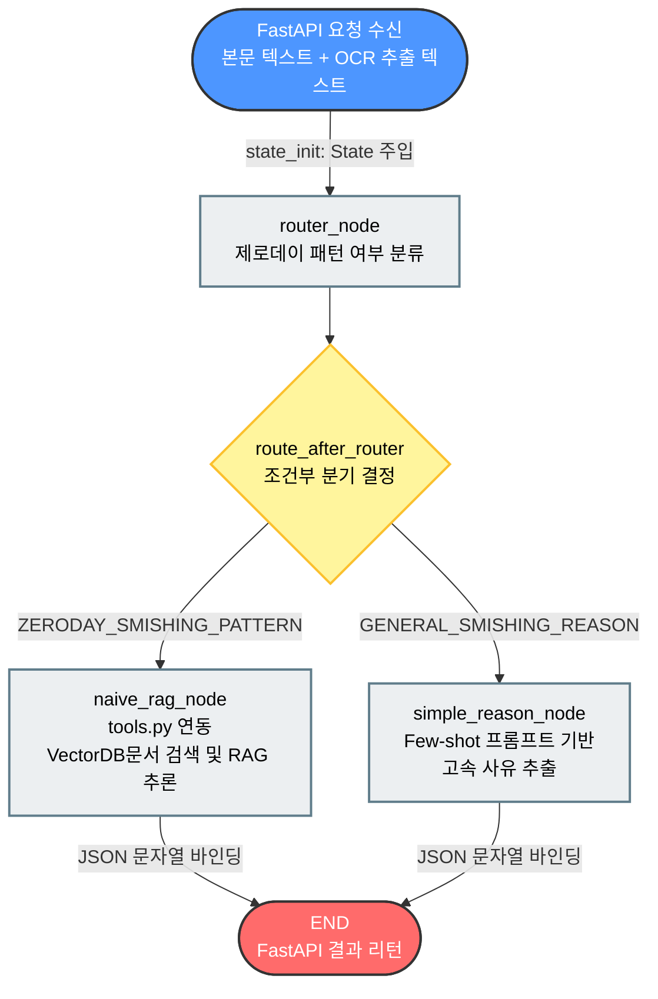

# AI Service

이 폴더는 모델 학습, 평가, inference 실험 코드를 관리하는 영역이다.

## Structure

```text
ai_service/
├── encoder/               # KcELECTRA Encoder 학습/평가/선택 모델
├── decoder/               # Qwen2.5 1.7b Decoder 모델 정리
├── src/ai_service/        # Python package skeleton
├── README.md
└── pyproject.toml
```

## Encoder

기본 프로젝트의 인코더 모델은 업데이트 되었다. 

자세한 내용은 https://huggingface.co/kdt-2-team4-newbiz/kcelectra-smishing-classifier 참조.

자세한 내용은 [encoder/README.md](encoder/README.md)를 참고한다.

## ai_service 폴더

심화 프로젝트 때 사용할 LLM(로컬 ollama, 운영 vllm) + RAG (vectordb + langgraph) 코드를 둔다. 랭그래프는 인코더가 스미싱 판별 시 llm-only의 일반 디코더 역할과 스미싱 모호 판단시 llm-with-rag의 rag pipeline을 구성하는 용도로 사용한다.

폴더 중 data/chroma_db 폴더는 .gitignore에 등록하였습니다.



## Local API Test

FastAPI는 LangGraph 로직과 Chroma RAG를 로컬에서 검증하기 위한 최소 API를 제공한다. 포트는 백엔드와 겹치지 않게 8080을 사용했다.

```bash
cd ai_service
uv run uvicorn ai_service.main:app --reload --port 8080
```

주요 엔드포인트:

- `GET /api/v1/health`: Ollama, Chroma, embedding 설정 확인
- `POST /api/v1/vectordb/upsert`: Chroma PersistentClient에 문서 upsert
- `POST /api/v1/vectordb/retrieve`: `jhgan/ko-sroberta-multitask` 임베딩 기반 retrieve 확인
- `POST /api/v1/graph/invoke`: FastAPI 요청으로 LangGraph 전체 흐름 실행

RAG 경로를 강제로 테스트하려면 `graph/invoke` 요청에 `"route_override": "zero_day"`를 넣는다.

예시:

```bash
curl -X POST http://127.0.0.1:8080/api/v1/vectordb/upsert \
  -H "Content-Type: application/json" \
  -d '{
    "documents": [
      "최근 택배 배송 조회를 사칭해 악성 앱 설치 링크를 보내는 스미싱 사례가 증가하고 있다."
    ],
    "metadatas": [{"source": "local-test", "category": "delivery"}]
  }'

curl -X POST http://127.0.0.1:8080/api/v1/graph/invoke \
  -H "Content-Type: application/json" \
  -d '{
    "text": "[CJ대한통운] 배송 주소 오류로 반송 예정입니다. http://delivery-check.example",
    "route_override": "zero_day"
  }'
```

## LangGraph 보완 제안

- 현재 Mermaid 흐름은 큰 방향이 맞다. 다만 `router_node`가 LLM 판단에 의존하므로 테스트 시에는 `route_override`로 RAG 경로를 강제 검증할 수 있게 했다.
- RAG 노드는 `messages`뿐 아니라 `context`, `final_output`도 state에 남겨 FastAPI 응답에서 검색 결과 주입 여부를 확인할 수 있게 했다.
- Chroma는 문서 저장과 검색 모두 동일한 `jhgan/ko-sroberta-multitask` 임베딩을 사용하도록 `query_embeddings` 기반으로 맞췄다.
- 운영 단계에서는 라우터 출력이 JSON이 아닌 키워드 문자열이라 파싱은 쉽지만 취약할 수 있다. 이후 `with_structured_output` 또는 enum parser로 바꾸는 것을 권장한다.
- Ollama 모델명은 `OLLAMA_MODEL_NAME` 환경변수로 통일했다. 로컬에서 실행 중인 모델명이 다르면 `.env`에서 이 값만 맞추면 된다.

## Notes

- 대용량 모델 파일과 dataset은 Git에 올리지 않는다.
- 실제 서비스에서 Hugging Face Endpoint를 호출하는 wrapper는 `deploy_wrapper/`에서 관리한다.
- `ai_service/`는 학습, 평가, 실험 이력을 정리하는 모델링 담당 영역으로 둔다.
