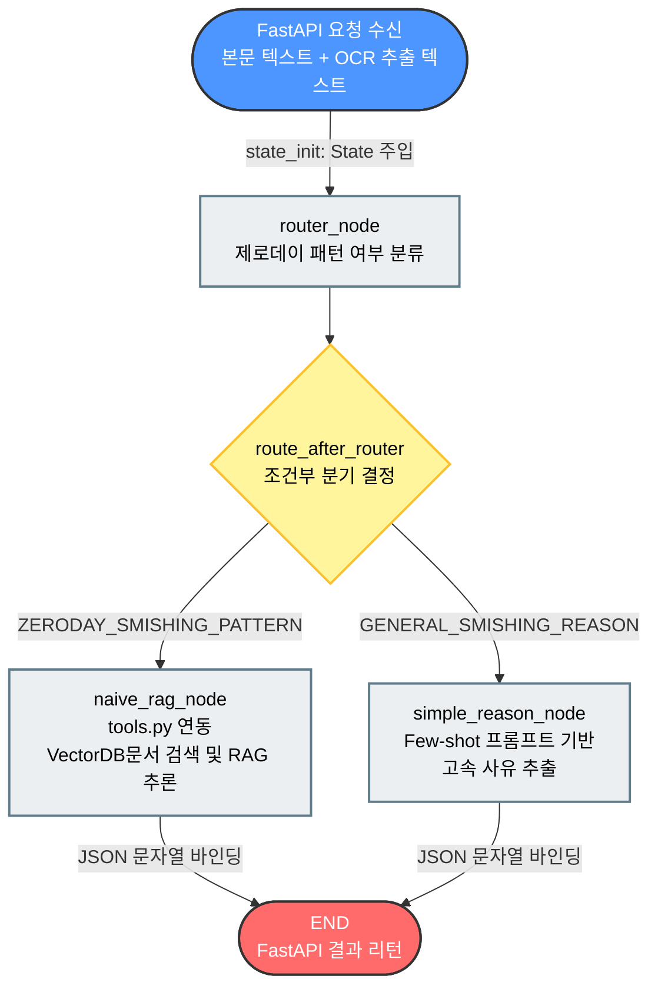

# 프로젝트에 사용한 랭그래프 핵심 정리

# graph.py의 흐름 시각화

## 테스트 메모

- 로컬 로직 테스트에서는 `route_override="zero_day"`를 state에 넣어 RAG 경로를 강제로 검증할 수 있다.
- `naive_rag_node`는 검색 context와 최종 JSON 문자열을 각각 `context`, `final_output`에 저장한다.
- Chroma 검색은 저장 시 사용한 임베딩 모델과 동일하게 `query_embeddings`로 수행한다.
