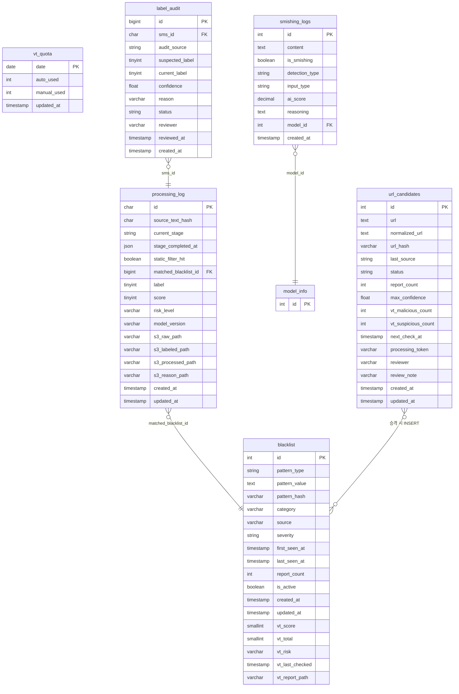

```mermaid
erDiagram
blacklist {
int id PK
string pattern_type
text pattern_value
varchar pattern_hash
varchar category
varchar source
string severity
timestamp first_seen_at
timestamp last_seen_at
int report_count
boolean is_active
timestamp created_at
timestamp updated_at
smallint vt_score
smallint vt_total
varchar vt_risk
timestamp vt_last_checked
varchar vt_report_path
}

    url_candidates {
        int id PK
        text url
        text normalized_url
        varchar url_hash
        string last_source
        string status
        int report_count
        float max_confidence
        int vt_malicious_count
        int vt_suspicious_count
        timestamp next_check_at
        varchar processing_token
        varchar reviewer
        varchar review_note
        timestamp created_at
        timestamp updated_at
    }

    vt_quota {
        date date PK
        int auto_used
        int manual_used
        timestamp updated_at
    }

    smishing_logs {
        int id PK
        text content
        boolean is_smishing
        string detection_type
        string input_type
        decimal ai_score
        text reasoning
        int model_id FK
        timestamp created_at
    }

    model_info {
        int id PK
    }

    processing_log {
        char id PK
        char source_text_hash
        string current_stage
        json stage_completed_at
        boolean static_filter_hit
        bigint matched_blacklist_id FK
        tinyint label
        tinyint score
        varchar risk_level
        varchar model_version
        varchar s3_raw_path
        varchar s3_labeled_path
        varchar s3_processed_path
        varchar s3_reason_path
        timestamp created_at
        timestamp updated_at
    }

    label_audit {
        bigint id PK
        char sms_id FK
        string audit_source
        tinyint suspected_label
        tinyint current_label
        float confidence
        varchar reason
        string status
        varchar reviewer
        timestamp reviewed_at
        timestamp created_at
    }

    smishing_logs }o--|| model_info : "model_id"
    processing_log }o--|| blacklist : "matched_blacklist_id"
    label_audit }o--|| processing_log : "sms_id"
    url_candidates }o--o{ blacklist : "승격 시 INSERT"
```
